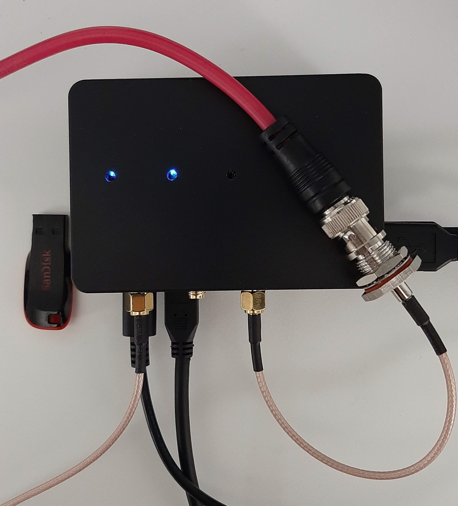
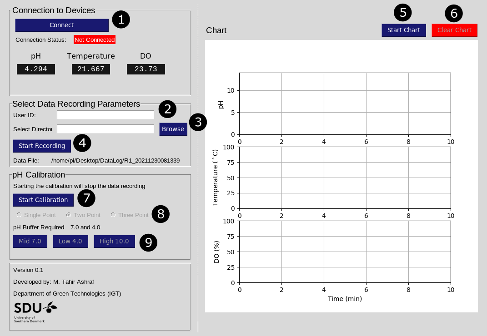

# BPC
Bioprocess Controller

# Introduction 
This manual outlines the basic information to use the Bioprocess Controller (BPC) and its App. BPC is small and low cost control unit to record the data and control parameters for lab- and pilot-scale fermentation and biochemical experimental setups. BPC is a small and low cost solution and is developed using Raspberry Pi.



The BPC can be customized to record a combination of different parameters at a time. BPC uses sensor made by [AtlasScientific](<https://atlas-scientific.com/>) or a similar vendor. Currently, BPC can be customized to record data from the following sensors:

- pH (available)
- Temperature (available)
- ORP
- Dissolved oxygen (available)
- Humidity
- Pressure
- Liquid flowmeter

Following parameters can be controlled:

- Addition of liquid using persitaltic pumps
	- For pH Control
	- For different modes of liquid feed addition and product removal

# BPC App
To make it easy for the general use of BPC, a graphical user interface (GUI) is developed. BPC app is made open-source, and can be customized along with the customization of the hardware.

## Starting the App
1. Connect all the sensor probes to BPC.
2. Connect the power to BPC unit (i.e. power up the Raspberry Pi).
3. Start the `terminal` 
5. Change the directory to the folder where BPC app is stored. For example, in the following, the app is stored in the folder `Desktop/BPC_v0.1`
 ```shell
$ cd Desktop/BPC
```
6. Start the BPC App using the following command
```shell
$ python3 BPC.py
```

This will open the following window.



## Recording the Data

Once the BPC App is running, it can be used to record the data data by using the following procedure.

1. Click on the button **Connect** labelled as **1**. This will make the connection to available sensors on BPC. If successful, it will change the status to **Connected** and start showning the instant values from the connected sensors.
2. Enter the **User ID** in the text box labelled as **2**. This could be experiment ID or group ID etc.
3. Click on the button **Browse** labelled as **3** and select the directory where the data file is to be stored.
4. Click the button **Start Recording** to start recording the sensor data. It will create a *.txt* file with autogenerated name using **User ID** and current time stamp.
5. To **Stop** the recording of the data click the button **Stop Recording**.

## Visualizing the Data
The recent data can be visualized in the chart window. 
1. Click the button **Start Chart** to start the chart.
2. Click the button **Clear Chart** to clear the current chart window.
3. Click the button **Stop Chart** to stop the plotting the data in the chart.

> Starting or stopping the chart have no effect of data recording or pH calibrations.

## pH Calibration
Follow the following procedure to calibrate a pH probe.

> Note Starting the pH calibration will stop the recording of data.

1. Click the button **Start Calibration**. This will enable selection among the 3 available options for pH calibration.
2. Select among the 3 options for calibration points:
	1. Single Point (pH 7.0)
	2. Two Point (pH 7.0 and 4.0)
	3. Three point (pH 7.0, 4.0, and 10.0).
3. Based on the selection in step 2, the corresponding calibration buttons are activated. **The first calibration point in all the cases is at pH 7.0.**
4. Clean the probe and place in the appropriate pH buffer solution. Wait till the pH value is stable, which can be seen on the instant value display or on the chart.  **Waiting period is typically 3 to 5 minutes.** 
5. Once the pH value is table, press the appropriate calibration point button to send the calibration command to the sensor. For example, click the button **Mid 7.0** to calibrate the pH sensor at pH of 7.0.
6. Repeat steps 5-7 to add other pH calibration points.
